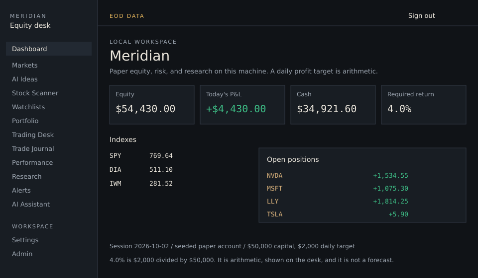
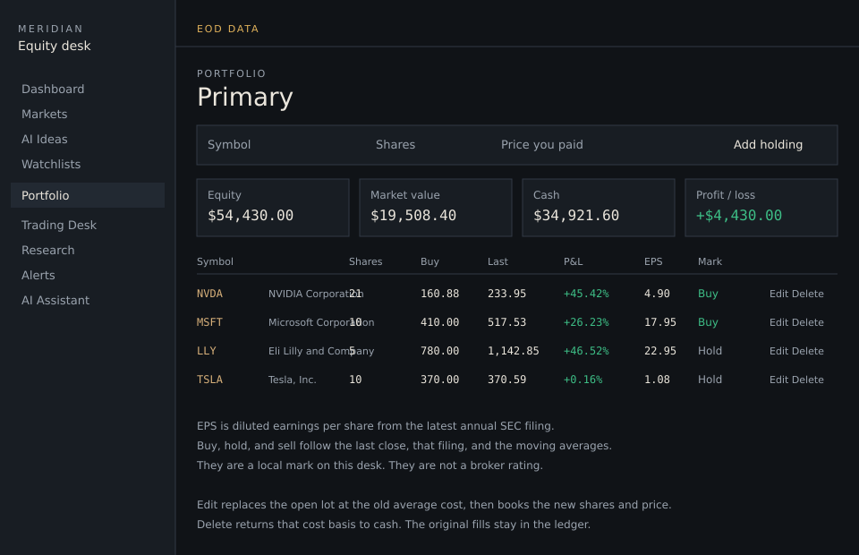
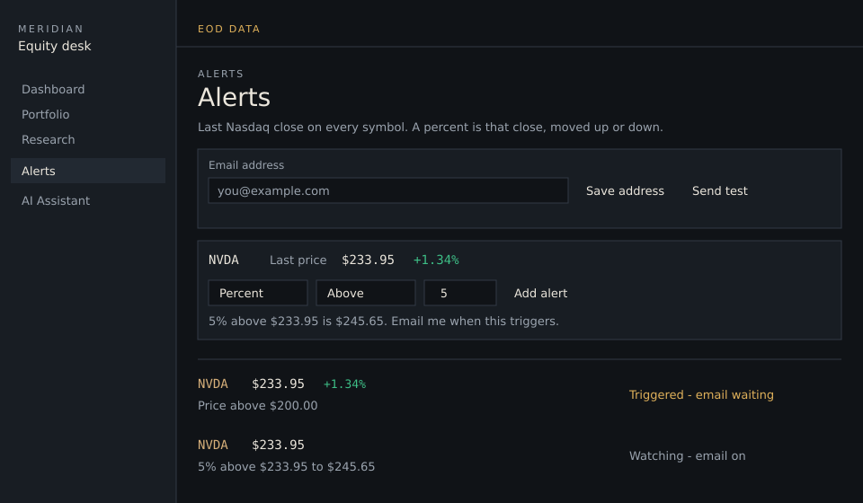
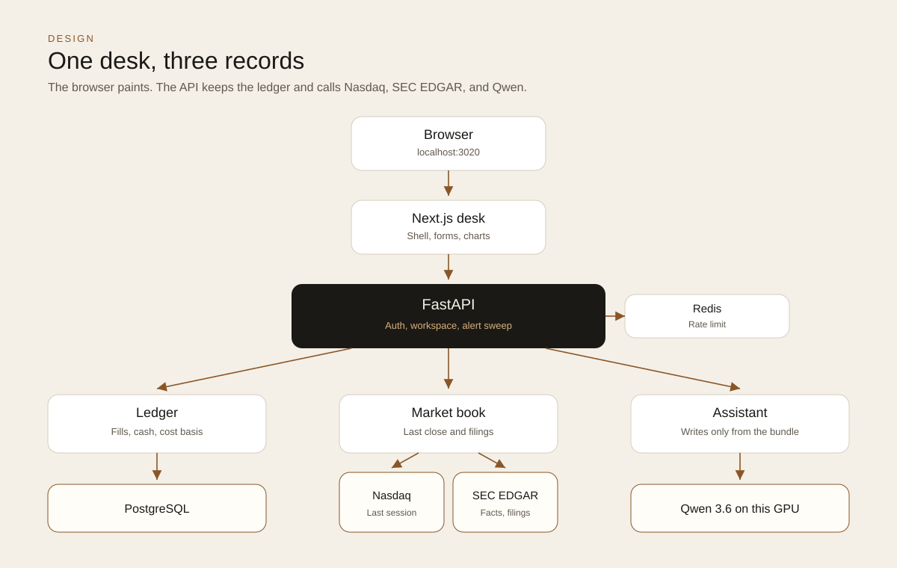
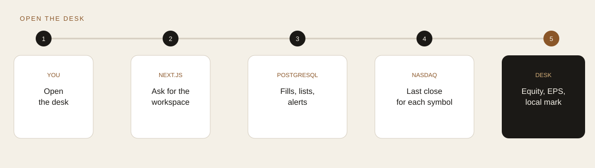
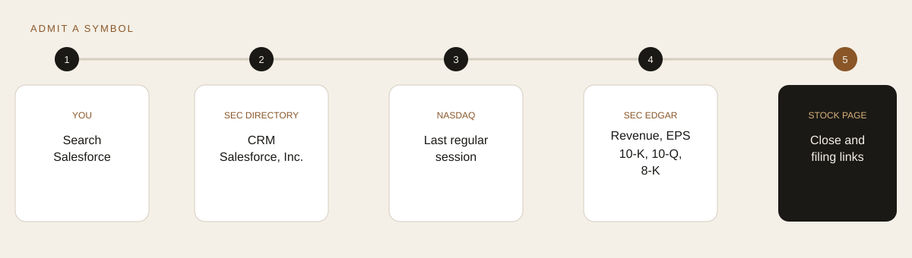
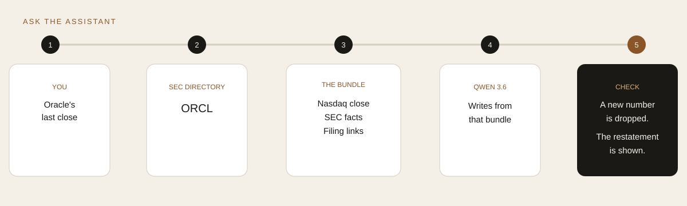
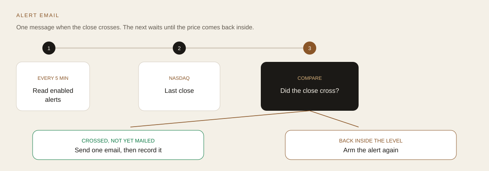

# Meridian

Meridian is a US equity desk that runs on this machine. The last Nasdaq regular session, the SEC filing, and a paper ledger sit behind one interface. Prices on the screen are that close, or a number you typed. The assistant repeats figures from those records.

A $50,000 account with a $2,000 daily target is a 4.0% return. The desk shows that ratio as arithmetic. It is not a forecast, and the product does not promise a profit.

On this DGX the desk is [http://localhost:3020](http://localhost:3020). The API is [http://127.0.0.1:8000](http://127.0.0.1:8000). Port 3000 is already Grafana here. A full Compose stack still publishes the web app on port 3000.

Sign in with `demo@meridian.local` / `meridian-demo`. The seeded book below is the paper account after the last regular session, Friday 2026-10-02.

## The desk

The shell is a 240px rail and a single reading column. Dark is the default. Numbers use a monospace face so a column of prices stays aligned. The header carries one status: `EOD DATA` when the book is the Nasdaq session, `DEMO DATA` when tests are on the mock tape.



Three screens carry the product. The rest of the nav is the same shell with a different job: markets, a five-name idea list, a scanner, watchlists, a paper order ticket, a journal, performance, a filing reader, alerts, and the assistant.

### Portfolio

A holding is not a stored row. It is the open quantity left after the fills. You enter the symbol, the shares, and the price you paid. Profit and loss is the last close against that cost. EPS is diluted earnings per share from the latest annual SEC filing. Buy, hold, and sell is a local mark from that close, the filing, and the moving averages. The page says so.

Edit closes the old lot at its average cost, so that close books no profit, then buys the new shares at the new price. Cash moves by the difference in cost. Delete returns the cost basis to cash. The original fills stay in the ledger.



### Alerts

Every alert shows the last close beside the symbol. A price alert is a dollar level. A percent alert freezes that close when you save it and watches a level above or below it: 5% above $233.95 is $245.65. The API checks enabled alerts about every five minutes. The first time the close crosses the level, one email goes out. The next email waits until the price has moved back inside the level.

Mail needs an address on this page and `SMTP_HOST` plus `SMTP_FROM` in the API environment. Until then a hit stays on the row as email waiting.



### Research and the assistant

A symbol search reads the SEC company-ticker file, then asks Nasdaq for that symbol's session history. The stock page shows the close, the filed facts, and links to the 10-K, 10-Q, and 8-K. The assistant receives that same bundle. A number in the answer has to appear in the bundle. Qwen 3.6 on this machine does the writing. With no model configured, the desk restates the bundle in plain sentences.

## Design

The browser paints. The API admits a symbol, keeps the ledger, and calls the model. Domain packages own the math. The web app formats a decimal. It does not recompute cost basis, rank, or position size.



| Piece | What it owns |
| --- | --- |
| `apps/web` | Shell, forms, charts, theme. Session cookie stays first-party because Next proxies `/api`. |
| `apps/api` | Auth, validation, the workspace, audit rows, the alert sweep. |
| `packages/market-data` | Nasdaq session history, SEC ticker search, company facts, filing links. |
| `packages/research` | The evidence card the stock page and the assistant both read. |
| `packages/ai` | The local model call. Empty or leaked numbers fall back to the evidence card. |
| `packages/analytics` | Fills, cost basis, P&L, the holding mark, idea scores. |
| `packages/trading` | Paper orders and position size. |
| `packages/database` | Users, fills, watchlists, alerts, journal, saved ideas. |
| `packages/config` | Product constants, including the score weights, and the environment. |

Money and share counts are `Decimal` in Python and `NUMERIC` in PostgreSQL. Timestamps are UTC. Passwords are scrypt hashes. Mutating routes require the session cookie and write an audit row. A Redis limit covers the API. If Redis is down, a process-local limit still applies.

`DATA_MODE=live` is this machine. `DATA_MODE=mock` is what the tests run, so a unit test never calls Nasdaq. Live ideas do not use a synthetic analyst card. When a filing has no target, the page says the consensus is unavailable.

Package boundaries and the later AWS seams are in [ARCHITECTURE.md](ARCHITECTURE.md). Terraform there is a placeholder. This desk does not call AWS.

## How a request moves

Opening the desk loads one workspace: the user, the ledger, the open marks, and the alert check.



Naming a company admits it. The core tape is fifteen names. Anything else is loaded when you search, watch, or trade it.



The assistant is the same evidence, written out. A company name of four or more letters resolves through the SEC directory, so "Oracle" becomes ORCL. The model is told to use only the bundle. If the reply is empty, or it introduces a number that was not in the bundle, the desk shows the plain restatement instead.



An alert email is a rising edge. The sweep runs in the API process. It does not send again while the condition stays true.



## Stack

| Layer | On this machine |
| --- | --- |
| Web | Next.js 16, React 19, TypeScript, Tailwind |
| API | FastAPI, Python 3.12 |
| Database | PostgreSQL 16, host port 5433 |
| Cache | Redis 7 |
| Session history | Nasdaq historical JSON, cached in the process for 15 minutes |
| Filings | SEC EDGAR company facts and submissions |
| Model | Ollama, `qwen3.6:latest`, on the local GPU |
| Tests | `DATA_MODE=mock`, so a test never calls Nasdaq |

## Run

Setup, migrations, and the test command are in [LOCAL_DEVELOPMENT.md](LOCAL_DEVELOPMENT.md).

```bash
cp .env.example .env
docker compose up postgres redis
```

Then the API and the web app. On this machine:

```bash
# API, from the repo root, using the project virtualenv
.venv/bin/python -m uvicorn meridian_api.main:app --host 127.0.0.1 --port 8000

# Web
cd apps/web && npm run dev -- --port 3020
```

Set `DATA_MODE=live` and `LOCAL_AI_MODEL=qwen3.6:latest` in `.env` for the real session and the local model. Leave the model empty and the assistant restates the evidence card. Alert mail stays on the page until `SMTP_HOST` and `SMTP_FROM` are set.

## Repository

```
apps/web                 the desk
apps/api                 HTTP, auth, alert sweep
packages/market-data     Nasdaq session and SEC filings
packages/research        evidence cards
packages/ai              Qwen, with a grounded fallback
packages/analytics       ledger, P&L, scores, holding mark
packages/trading         paper orders and size
packages/database        schema and seed
packages/config          product constants and settings
docs/mockups             the frames above
infrastructure/docker
tests
```

## Further reading

- [ARCHITECTURE.md](ARCHITECTURE.md)
- [ROADMAP.md](ROADMAP.md)
- [DATABASE_DESIGN.md](DATABASE_DESIGN.md)
- [LOCAL_DEVELOPMENT.md](LOCAL_DEVELOPMENT.md)
- [API.md](API.md)
- [CHANGELOG.md](CHANGELOG.md)
- [TEST_REPORT.md](TEST_REPORT.md)

## Disclaimer

This platform provides market information, research aggregation, analytics, paper-trading tools, and AI-generated insights for informational and educational purposes only. It does not provide personalized investment advice or guarantee investment results. Past performance does not guarantee future results. Users are responsible for their own investment decisions.
